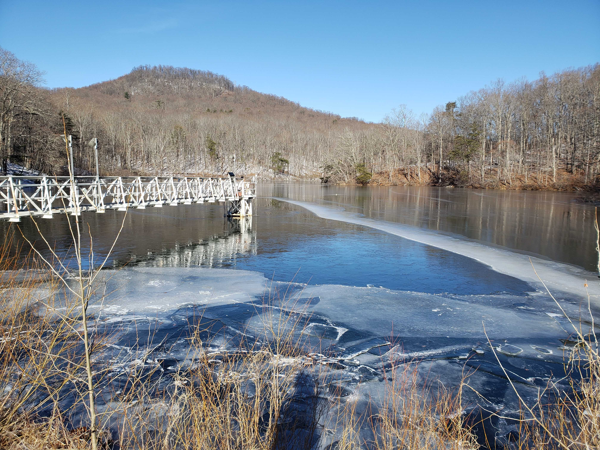
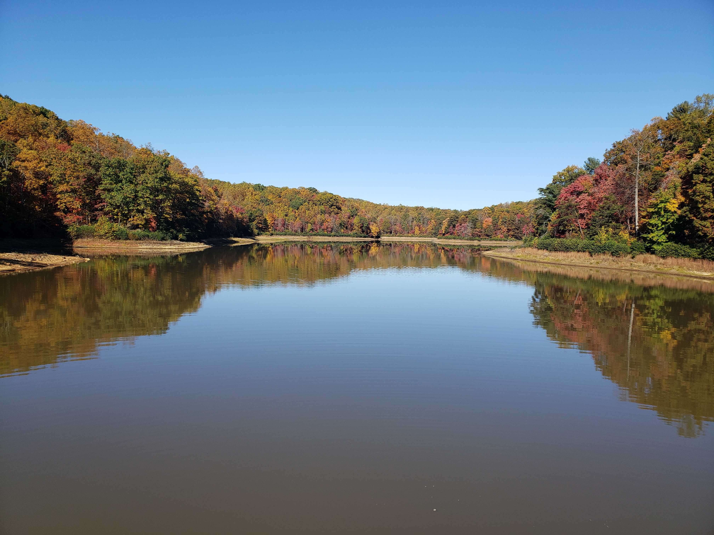
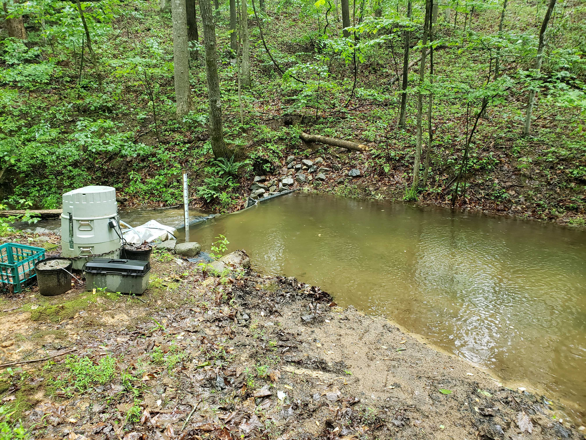

Our ecosystem monitoring, data publishing, and forecasting program is focused on two drinking water reservoirs co-located in the Blue Ridge Mountains in southwestern Virginia, USA. Falling Creek and Beaverdam Reservoirs were built in the late 1800s and have similar morphometry, dimictic thermal dynamics, meso-eutrophic chemistry, and catchment land use. Both reservoirs are located on the [homeland of the Tutelo/Monacan People](https://www.inclusive.vt.edu/resources/land-acknowledgement-and-labor-recognition.html) and are managed as drinking water sources by the [Western Virginia Water Authority](https://www.westernvawater.org). Falling Creek and Beaverdam Reservoirs are two of the southernmost waterbodies in the USA that still exhibit ice cover during the winter (intermittently through December-February). 

## Falling Creek Reservoir

Falling Creek Reservoir is a shallow (maximum depth at full pond = 9.3 m), small (0.119 square km) reservoir located at 37.30325 latitude, -79.8373 longitude. Falling Creek Reservoir has a hypolimnetic oxygenation (side-stream supersaturation) system, which maintains the hypolimnion as oxic during the summer stratified period.

## Beaverdam Reservoir

Beaverdam Reservoir is a shallow (maximum depth at full pond = 13.4 m), small (0.39 square km) reservoir located at 37.314783, -79.820864. The hypolimnion of Beaverdam Reservoir quickly becomes anoxic after the onset of summer stratification.

## Tunnel Branch

Tunnel Branch is a 1.7 km-long stream that connects upstream Beaverdam Reservoir to downstream Falling Creek Reservoir.
