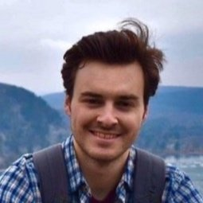
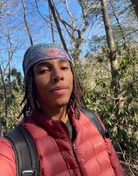
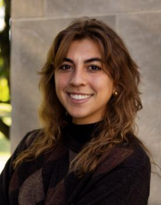
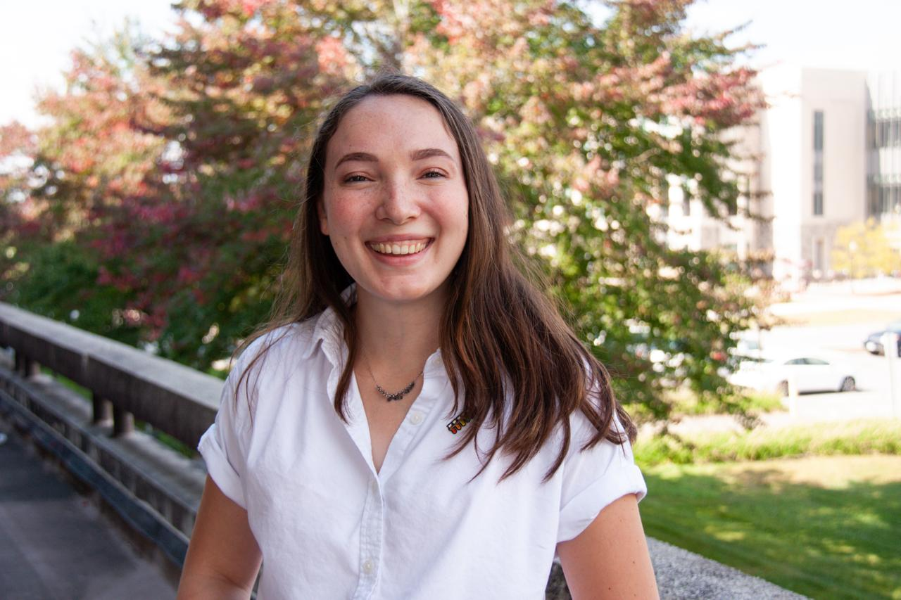
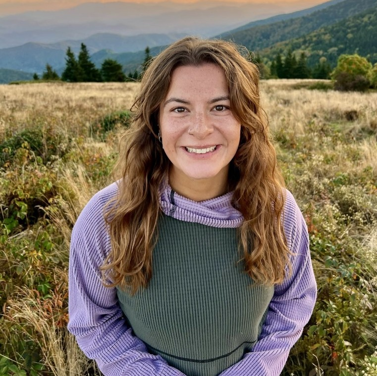
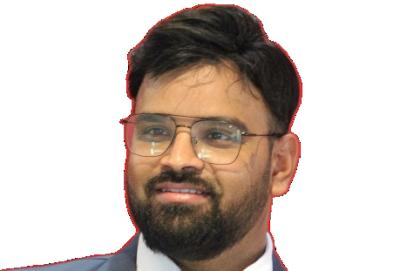

# Faculty

{::nomarkdown}
{:/nomarkdown}
{: .profile-img}
### [<i class="fa fa-link" aria-hidden="true"></i> Dr. Cayelan Carey](http://www.carey.biol.vt.edu/){: .clear-both}
{::nomarkdown}
{:/nomarkdown}
Professor, Carey Lab, Department of Biological Sciences, Virginia Tech
{::nomarkdown}

{:/nomarkdown}

{::nomarkdown}
{:/nomarkdown}
{: .profile-img}
### [<i class="fa fa-link" aria-hidden="true"></i> Dr. Quinn Thomas](https://www.rquinnthomas.com){: .clear-both}
{::nomarkdown}
{:/nomarkdown}
Professor, Department of Forest Resources & Environmental Conservation, Virginia Tech
{::nomarkdown}

{:/nomarkdown}

{::nomarkdown}
{:/nomarkdown}
{: .profile-img}
### [<i class="fa fa-link" aria-hidden="true"></i> Dr. Madeline Schreiber](https://geos.vt.edu/people/Everyone/Madeline-Schreiber.html){: .clear-both}
{::nomarkdown}
{:/nomarkdown}
Professor, Department of Geoscience, Virginia Tech
{::nomarkdown}

{:/nomarkdown}

{: .clear-both}

# Researchers, Technicians, & Students

{::nomarkdown}
{:/nomarkdown}
{: .profile-img}
### [<i class="fa fa-link" aria-hidden="true"></i> Adrienne Breef-Pilz](https://carey.biol.vt.edu/?page_id=1615)
{::nomarkdown}
{:/nomarkdown}
Field Program Manager, Carey Lab & Center for Ecosystem Forecasting, Virginia Tech
{::nomarkdown}

{:/nomarkdown}

{::nomarkdown}
{:/nomarkdown}
{: .profile-img}
### [<i class="fa fa-link" aria-hidden="true"></i> Austin Delany](https://www.ecoforecastprojectvt.org/about-us)
{::nomarkdown}
{:/nomarkdown}
Data Scientist, Center for Ecosystem Forecasting, Virginia Tech
{::nomarkdown}

{:/nomarkdown}

{::nomarkdown}
{:/nomarkdown}
{: .profile-img}
### [<i class="fa fa-link" aria-hidden="true"></i> Mary Lofton](https://www.maryelofton.com/)
{::nomarkdown}
{:/nomarkdown}
Research Scientist, Center for Ecosystem Forecasting, Virginia Tech
{::nomarkdown}

{:/nomarkdown}

{::nomarkdown}
{:/nomarkdown}
{: .profile-img}
### [<i class="fa fa-link" aria-hidden="true"></i> Freya Olsson](https://carey.biol.vt.edu/?page_id=1707)
{::nomarkdown}
{:/nomarkdown}
Post-doctoral associate, Department of Biological Sciences, Virginia Tech
{::nomarkdown}

{:/nomarkdown}

{::nomarkdown}
{:/nomarkdown}
{: .profile-img}
### [<i class="fa fa-link" aria-hidden="true"></i> Dexter Howard](https://carey.biol.vt.edu/?page_id=1679)
{::nomarkdown}
{:/nomarkdown}
PhD Student, Carey Lab, Department of Biological Sciences, Virginia Tech
{::nomarkdown}

{:/nomarkdown}

{::nomarkdown}
{:/nomarkdown}
{: .profile-img}
### [<i class="fa fa-link" aria-hidden="true"></i> Dominique Edwards](https://globalchange.vt.edu/graduate/people-of-the-igc/current-fellows/edwards-dominique.html)
{::nomarkdown}
{:/nomarkdown}
PhD Student, Carey Lab, Department of Biological Sciences, Virginia Tech
{::nomarkdown}

{:/nomarkdown}

{::nomarkdown}
{:/nomarkdown}
{: .profile-img}
### [<i class="fa fa-link" aria-hidden="true"></i> Maria Popescu](https://globalchange.vt.edu/graduate/people-of-the-igc/current-fellows/popescu-maria.html)
{::nomarkdown}
{:/nomarkdown}
PhD Student, Carey Lab, Department of Biological Sciences, Virginia Tech
{::nomarkdown}

{:/nomarkdown}

{::nomarkdown}
{:/nomarkdown}
{: .profile-img}
### [<i class="fa fa-link" aria-hidden="true"></i> Katie Hoffman](https://carey.biol.vt.edu/?page_id=13)
{::nomarkdown}
{:/nomarkdown}
PhD Student, Carey Lab, Department of Biological Sciences, Virginia Tech
{::nomarkdown}

{:/nomarkdown}

{::nomarkdown}
{:/nomarkdown}
{: .profile-img}
### [<i class="fa fa-link" aria-hidden="true"></i> Cecelia Wood](https://geos.vt.edu/people/Everyone/wood--cecelia.html)
{::nomarkdown}
{:/nomarkdown}
PhD Student, Schreiber Lab, Department of Geosciences, Virginia Tech
{::nomarkdown}

{:/nomarkdown}

{::nomarkdown}
{:/nomarkdown}
{: .profile-img}
### [<i class="fa fa-link" aria-hidden="true"></i> Carly Bauer](https://geos.vt.edu/people/Everyone/bauer--carly.html)
{::nomarkdown}
{:/nomarkdown}
MS Student, Schreiber Lab, Department of Geosciences, Virginia Tech
{::nomarkdown}

{:/nomarkdown}

{::nomarkdown}
{:/nomarkdown}
{: .profile-img}
### [<i class="fa fa-link" aria-hidden="true"></i> Rohit Shukla](https://ecoforecast.centers.vt.edu/about.html)
{::nomarkdown}
{:/nomarkdown}
Post-doctoral associate, Carey Lab, Department of Biological Sciences, Virginia Tech
{::nomarkdown}

{:/nomarkdown}

# Partners

## [<i class="fa fa-link" aria-hidden="true"></i> Western Virginia Water Authority](https://www.westernvawater.org)  
The mission of the Western Virginia Water Authority is to protect and manage essential water resources through the delivery of quality water and wastewater service to our customers.
## [<i class="fa fa-link" aria-hidden="true"></i> Virginia Tech Center for Ecosystem Forecasting](https://ecoforecast.centers.vt.edu/)  
Predicting nature like we predict the weather: rigorously, reliably, and with uncertainty quantified.
## [<i class="fa fa-link" aria-hidden="true"></i> GLEON](http://gleon.org)  
The Global Lake Ecological Observatory Network conducts innovative science by sharing and interpreting high-resolution sensor data to understand, predict, and communicate the role and response of lakes in a changing global environment.
## [<i class="fa fa-link" aria-hidden="true"></i> Macrosystems EDDIE](http://macrosystemseddie.org)  
Macrosystems EDDIE (Environmental Data-Driven Inquiry & Exploration) builds flexible teaching modules to teach undergraduate students macrosystems ecology concepts while building their simulation modeling and computing skills.
## [<i class="fa fa-link" aria-hidden="true"></i> Renato Figueiredo, Oregon State University](https://engineering.oregonstate.edu/people/renato-figueiredo)  
Professor, School of Electrical Engineering and Computer Science, Oregon State University
## [<i class="fa fa-link" aria-hidden="true"></i> Mark Johnson, University of British Columbia](https://ecohydro.ires.ubc.ca)  
Professor, IRES, Earth, Ocean and Atmospheric Sciences, Canada Research Chair (T2, Ecohydrology)

# Alumni

## Postdocs
- Ryan McClure
- Alexandria Hounshell
- Kaitlin Farrell

## Graduate
- Rick Browne
- Alexandra Gerling
- Kathleen Hamre
- Jonathan Doubek
- Ryan McClure
- Mary Lofton
- Nicole Ward
- Whitney Woelmer
- Abigail Lewis
- Heather Wander
- Dexter Howard
- Kathryn Hoffman
- Bibek Kandel
- Dominique Edwards
- Maria Popescu
- Zackary Munger
- Katie Krueger
- Nick Hammond
- Cecelia Wood
- Cissy Ming
- Carly Bauer
- Rachel Corrigan

## Undergraduate
- Miranda Flood
- Elle Humes
- Christina Urbancyzk
- Mariah Haberman
- Mariah Redmond
- Charlotte Harrell
- Zach Gajewski
- Madeline Ryan
- Spencer Klepatzki
- Katie Krueger
- Joseph Famularo
- Leah Finegold
- Kylie Campbell
- Dexter Howard
- Arianna Krinos
- Miles Goodall
- Niall Goard
- Beatrice Scott
- Claire Vavrus
- James Maze
- Ashley Mickens
- Rose Thai
- Jacob Wynne
- Arpita Das
- Caroline Bryant
- Beckett Geisler
- Connor Gnasso
- Nick Ruszkowski
- Mitchell Turnage
- George Haynie
- Evelyn Tipper
- Michael Kricheldorf
- Ryan Keverline
- Sierra Tannheiser
- Sean Kenny
- Tallory Wendell
- Matthew Centofanti
- Quin Campbell
- Erin Walters
- Arwen Downum
