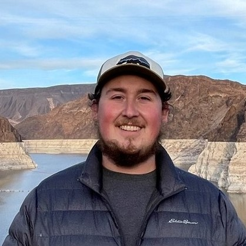
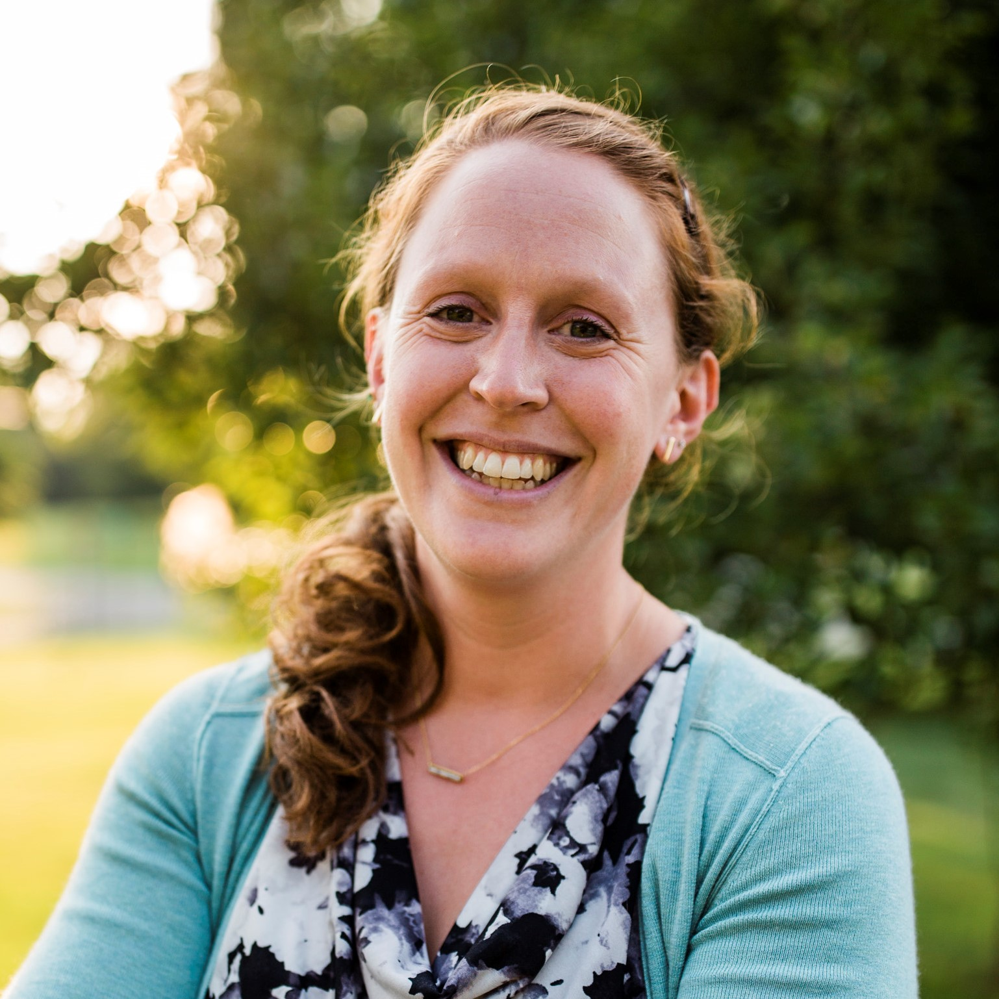
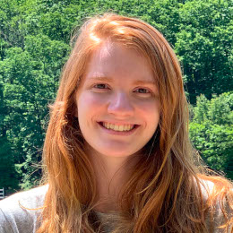
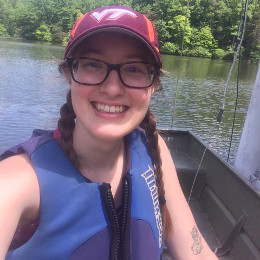

# Faculty

{::nomarkdown}
{:/nomarkdown}
{: .profile-img}
### [<i class="fa fa-link" aria-hidden="true"></i> Dr. Cayelan Carey](http://www.carey.biol.vt.edu/){: .clear-both}
{::nomarkdown}
{:/nomarkdown}
Professor, Carey Lab, Department of Biological Sciences, Virginia Tech
{::nomarkdown}

{:/nomarkdown}

{::nomarkdown}
{:/nomarkdown}
{: .profile-img}
### [<i class="fa fa-link" aria-hidden="true"></i> Dr. Quinn Thomas](https://www.rquinnthomas.com){: .clear-both}
{::nomarkdown}
{:/nomarkdown}
Associate Professor, Department of Forest Resources & Environmental Conservation, Virginia Tech
{::nomarkdown}

{:/nomarkdown}

{::nomarkdown}
{:/nomarkdown}
{: .profile-img}
### [<i class="fa fa-link" aria-hidden="true"></i> Dr. Madeline Schreiber](https://geos.vt.edu/people/Everyone/Madeline-Schreiber.html){: .clear-both}
{::nomarkdown}
{:/nomarkdown}
Professor, Department of Geoscience, Virginia Tech
{::nomarkdown}

{:/nomarkdown}

{: .clear-both}

# Researchers, Technician, & Students

{::nomarkdown}
{:/nomarkdown}
{: .profile-img}
### [<i class="fa fa-link" aria-hidden="true"></i> Adrienne Breef-Pilz](https://carey.biol.vt.edu/?page_id=1615)
{::nomarkdown}
{:/nomarkdown}
Field Program Manager, Carey Lab, Virginia Tech
{::nomarkdown}

{:/nomarkdown}

{::nomarkdown}
{:/nomarkdown}
{: .profile-img}
### [<i class="fa fa-link" aria-hidden="true"></i> Austin Delany](https://www.ecoforecastprojectvt.org/about-us)
{::nomarkdown}
{:/nomarkdown}
Data Scientist, Ecological Forecasting Project, Virginia Tech
{::nomarkdown}

{:/nomarkdown}

{::nomarkdown}
{:/nomarkdown}
{: .profile-img}
### [<i class="fa fa-link" aria-hidden="true"></i> Dexter Howard](https://carey.biol.vt.edu/?page_id=1679)
{::nomarkdown}
{:/nomarkdown}
PhD Student, Carey Lab, Department of Biological Sciences, Virginia Tech
{::nomarkdown}

{:/nomarkdown}

{::nomarkdown}
{:/nomarkdown}
{: .profile-img}
### [<i class="fa fa-link" aria-hidden="true"></i> Mary Lofton](https://www.maryelofton.com/)
{::nomarkdown}
{:/nomarkdown}
Post-doctoral associate, Carey Lab, Department of Biological Sciences, Virginia Tech
{::nomarkdown}

{:/nomarkdown}

{::nomarkdown}
{:/nomarkdown}
{: .profile-img}
### [<i class="fa fa-link" aria-hidden="true"></i> Freya Olsson](https://carey.biol.vt.edu/?page_id=1707)
{::nomarkdown}
{:/nomarkdown}
Post-doctoral associate, Department of Biological Sciences, Virginia Tech
{::nomarkdown}

{:/nomarkdown}

{::nomarkdown}
{:/nomarkdown}
{: .profile-img}
### [<i class="fa fa-link" aria-hidden="true"></i> Heather Wander](https://www.carey.biol.vt.edu/?page_id=1520)
{::nomarkdown}
{:/nomarkdown}
PhD Student, Carey Lab, Department of Biological Sciences, Virginia Tech
{::nomarkdown}

{:/nomarkdown}

{::nomarkdown}
{:/nomarkdown}
{: .profile-img}
### [<i class="fa fa-link" aria-hidden="true"></i> Katie Hoffman](https://carey.biol.vt.edu/?page_id=13)
{::nomarkdown}
{:/nomarkdown}
PhD Student, Carey Lab, Department of Biological Sciences, Virginia Tech
{::nomarkdown}

{:/nomarkdown}

# Alumni

{::nomarkdown}
{:/nomarkdown}
{: .profile-img}
### [<i class="fa fa-link" aria-hidden="true"></i> Bethany Bookout](https://www.carey.biol.vt.edu/?page_id=1293)
{::nomarkdown}
{:/nomarkdown}
Research Technician, Carey Lab, Department of Biological Sciences, Virginia Tech
{::nomarkdown}

{:/nomarkdown}

{::nomarkdown}
{:/nomarkdown}
{: .profile-img}
### [<i class="fa fa-link" aria-hidden="true"></i> Ryan McClure](http://www.globalchange.vt.edu/ryan-mcclure/)
{::nomarkdown}
{:/nomarkdown}
PhD Student, Carey Lab, Department of Biological Sciences, Virginia Tech
{::nomarkdown}

{:/nomarkdown}
