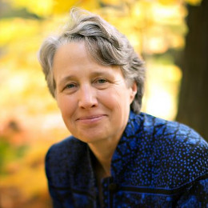
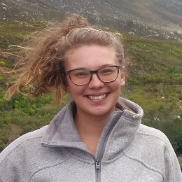

# Faculty

{::nomarkdown}
{:/nomarkdown}
{: .profile-img}
### [<i class="fa fa-link" aria-hidden="true"></i> Dr. Renato Figueiredo](https://www.acis.ufl.edu/people/renatof){: .clear-both}
{::nomarkdown}
{:/nomarkdown}
Professor, ACIS Lab, Department of Electrical & Computer Engineering, University of Florida
{::nomarkdown}

{:/nomarkdown}

{::nomarkdown}
{:/nomarkdown}
{: .profile-img}
### [<i class="fa fa-link" aria-hidden="true"></i> Dr. Quinn Thomas](https://www.epics.frec.vt.edu/){: .clear-both}
{::nomarkdown}
{:/nomarkdown}
Associate Professor, Department of Forest Resources & Environmental Conservation, Virginia Tech
{::nomarkdown}

{:/nomarkdown}

{::nomarkdown}
{:/nomarkdown}
{: .profile-img}
### [<i class="fa fa-link" aria-hidden="true"></i> Dr. Cayelan Carey](http://www.carey.biol.vt.edu/){: .clear-both}
{::nomarkdown}
{:/nomarkdown}
Associate Professor, Carey Lab, Department of Biological Sciences, Virginia Tech
{::nomarkdown}

{:/nomarkdown}

{::nomarkdown}
{:/nomarkdown}
{: .profile-img}
### [<i class="fa fa-link" aria-hidden="true"></i> Dr. Kathleen Weathers](https://www.caryinstitute.org/science/our-scientists/dr-kathleen-c-weathers){: .clear-both}
{::nomarkdown}
{:/nomarkdown}
Ecosystem Scientist, Cary Institute of Ecosystem Studies
{::nomarkdown}

{:/nomarkdown}

{: .clear-both}

# Researchers, Technician, & Students

{::nomarkdown}
{:/nomarkdown}
{: .profile-img}
### [<i class="fa fa-link" aria-hidden="true"></i> Freya Olsson](https://carey.biol.vt.edu/?page_id=1707)
{::nomarkdown}
{:/nomarkdown}
Post-doctoral associate, Department of Biological Sciences, Virginia Tech
{::nomarkdown}

{:/nomarkdown}

{::nomarkdown}
{:/nomarkdown}
{: .profile-img}
### [<i class="fa fa-link" aria-hidden="true"></i> Vahid Daneshmand](https://www.acis.ufl.edu/people/vdaneshmand)
{::nomarkdown}
{:/nomarkdown}
PhD Student, ACIS Lab, Department of Electrical & Computer Engineering, University of Florida
{::nomarkdown}

{:/nomarkdown}

{::nomarkdown}
{:/nomarkdown}
{: .profile-img}
### [<i class="fa fa-link" aria-hidden="true"></i> Whitney Woelmer](https://www.carey.biol.vt.edu/?page_id=1289)
{::nomarkdown}
{:/nomarkdown}
Master's Student, Carey Lab, Department of Biological Sciences, Virginia Tech
{::nomarkdown}

{:/nomarkdown}

{::nomarkdown}
{:/nomarkdown}
{: .profile-img}
### [<i class="fa fa-link" aria-hidden="true"></i> Dexter Howard](https://twitter.com/dexterhoward77?lang=en)
{::nomarkdown}
{:/nomarkdown}
Undergraduate Student, Carey Lab, Department of Biological Sciences, Virginia Tech
{::nomarkdown}

{:/nomarkdown}

# Alumni

{::nomarkdown}
{:/nomarkdown}
{: .profile-img}
### [<i class="fa fa-link" aria-hidden="true"></i> Bethany Bookout](https://www.carey.biol.vt.edu/?page_id=1293)
{::nomarkdown}
{:/nomarkdown}
Research Technician, Carey Lab, Department of Biological Sciences, Virginia Tech
{::nomarkdown}

{:/nomarkdown}

{::nomarkdown}
{:/nomarkdown}
{: .profile-img}
### [<i class="fa fa-link" aria-hidden="true"></i> Ryan McClure](http://www.globalchange.vt.edu/ryan-mcclure/)
{::nomarkdown}
{:/nomarkdown}
PhD Student, Carey Lab, Department of Biological Sciences, Virginia Tech
{::nomarkdown}

{:/nomarkdown}
